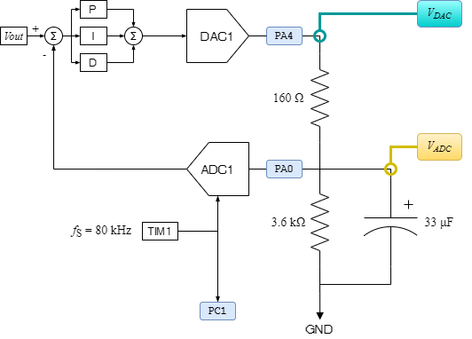
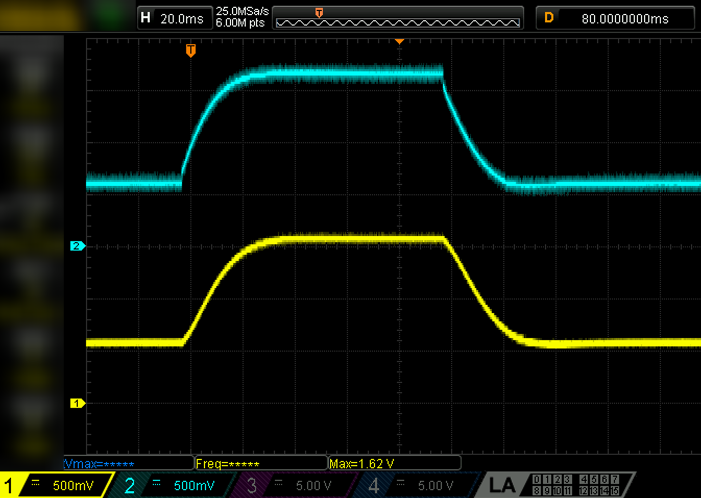
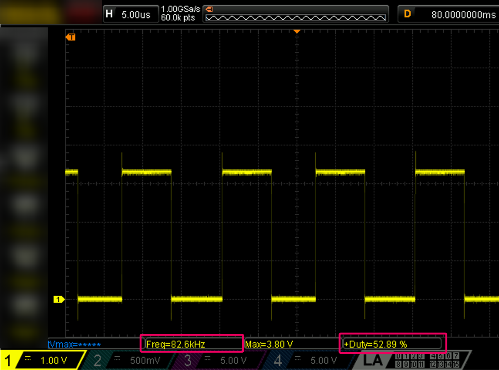

# STM32F3_CMSIS_PID_example
PID example implementation using the STM32f303re internal ADC / DAC / Timer and the CMSIS DSP library.

See `main.c`.

- STM32f303re Nucleo64 board
- `F_CPU` = 72 MHz
- `TIM1` Output Compare triggers `ADC1` at 80 kHz sample rate
- `ADC1` value is read and forwarded into CMSIS PID function
- CMSIS PID function output is applied to `DAC1`
- additional `TIM1` output on GPIO

### Schematic

### Control System Output

### Performance

- 287 cycles per sample
	+ 3% duty cycle at 8kHz vs. 72 MHz
	+ 53% duty cycle at 80kHz vs. 72 Mhz

